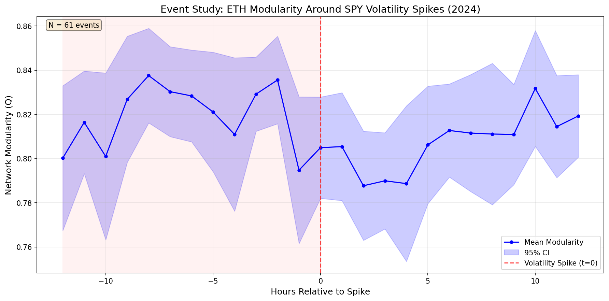
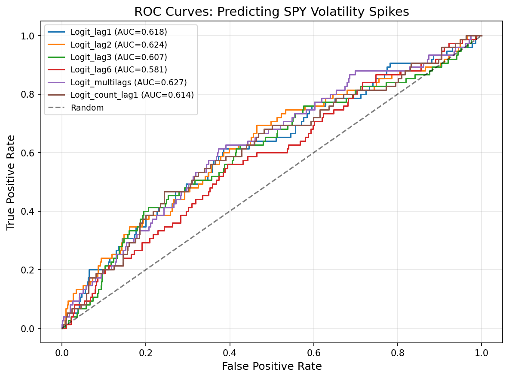

# Ethereum Network Modularity as a Leading Indicator of Equity Market Volatility

> **Capstone Research Project — NYU Tandon, Financial Engineering**

## Abstract

This project investigates whether structural changes in the Ethereum transaction network can serve as early-warning signals for equity market volatility. Specifically, we test whether **network modularity** — a measure of fragmentation in on-chain transaction graphs — increases prior to S&P 500 volatility spikes. We construct hourly weighted transaction networks from Ethereum mainnet data, compute Louvain modularity scores, and evaluate their predictive power for extreme SPY return events using event-study analysis and logistic regression with Newey-West standard errors.

## Hypothesis

**H2: Network modularity increases during volatility spikes.**

During periods of market stress, Ethereum transaction activity becomes more segmented — addresses transact within isolated clusters rather than across the broader network. This increase in modularity may precede equity market volatility spikes, providing a 24/7 early-warning indicator that is not constrained by traditional market trading hours.

## Data

| Dataset | Source | Frequency | Period |
|---------|--------|-----------|--------|
| ETH Transactions | [Google BigQuery](https://cloud.google.com/bigquery/public-data) `crypto_ethereum.transactions` | Hourly aggregation | 2024-01-01 to 2024-12-31 |
| SPY Price | [Yahoo Finance](https://finance.yahoo.com/) via `yfinance` | 1-hour bars | 2024-01-01 to 2024-12-31 |
| ETH Transactions (COVID) | Google BigQuery | Hourly aggregation | 2020-01-15 to 2020-04-30 |

> **Note**: Raw data files are not included in this repository due to size (~10-50 GB). See [Data Reproduction](#data-reproduction) below to regenerate them.

## Methodology

### 1. Network Construction
For each hour *t*, we construct a weighted undirected graph *G_t* where:
- **Nodes** = unique Ethereum addresses active within the hour
- **Edges** = transfers between address pairs
- **Weights** = total ETH transferred (value-weighted) or transaction count (count-weighted)

### 2. Modularity Measurement
We compute modularity *Q_t* using the **Louvain community detection algorithm**. Higher *Q_t* indicates stronger clustering and greater network fragmentation.

### 3. Volatility Spike Identification
Hourly SPY log-returns are computed as *r_t = ln(P_t / P_{t-1})*. A **volatility spike** is defined as an hour where |*r_t*| exceeds the 95th percentile of a 210-bar rolling window (~30 trading days).

### 4. Empirical Strategy
- **Event Study**: Average modularity trajectory from *t-12* to *t+12* hours around spike events
- **Predictive Regression**: Logistic model with HAC standard errors

```
Spike_t = α + β·Q_{t-1} + γ₁·log(N_t) + γ₂·Density_t + ε_t
```

where *N_t* = active nodes and *Density_t* = network density (controls for mechanical size effects).

## Project Structure

```
├── README.md
├── requirements.txt
├── .gitignore
├── config.py                        # Parameters and paths
├── src/
│   ├── __init__.py
│   ├── utils.py                     # Network construction and metric computation
│   ├── fetch_eth_data.py            # BigQuery ETH transaction extraction
│   ├── fetch_spy_data.py            # SPY price download
│   ├── build_networks.py            # Hourly graph construction and modularity
│   ├── compute_spikes.py            # Return computation and spike identification
│   ├── merge_dataset.py             # Panel dataset assembly
│   ├── event_study.py               # Event study analysis and plots
│   ├── regression.py                # Predictive logistic regression
│   └── robustness.py                # Robustness checks
├── notebooks/
│   └── exploration.ipynb            # EDA and preliminary visualizations
├── data/
│   ├── raw/                         # Raw CSVs (git-ignored)
│   └── processed/                   # Intermediate outputs (git-ignored)
├── output/
│   ├── figures/                     # Publication-ready plots
│   └── tables/                      # Regression and summary tables
└── run_pipeline.py                  # End-to-end pipeline runner
```

## Quick Start

### Prerequisites
- Python 3.10+
- Google Cloud account with BigQuery API enabled
- `gcloud` CLI authenticated (`gcloud auth application-default login`)

### Installation
```bash
git clone https://github.com/YOUR_USERNAME/eth-modularity-volatility.git
cd eth-modularity-volatility
pip install -r requirements.txt
```

### Configuration
Edit `config.py` and set your Google Cloud project ID:
```python
GCP_PROJECT_ID = "your-gcp-project-id"
```

### Run Full Pipeline
```bash
python run_pipeline.py
```

Or run individual steps:
```bash
python -m src.fetch_eth_data       # Download ETH transactions from BigQuery
python -m src.fetch_spy_data       # Download SPY hourly prices
python -m src.build_networks       # Compute hourly modularity, node count, density
python -m src.compute_spikes       # Compute SPY returns and spike indicators
python -m src.merge_dataset        # Assemble panel dataset
python -m src.event_study          # Event study analysis
python -m src.regression           # Predictive regression
python -m src.robustness           # Robustness checks
```

## Data Reproduction

Raw data is excluded from this repo (see `.gitignore`). To regenerate:

1. **ETH transactions**: Requires Google BigQuery access. `src/fetch_eth_data.py` contains the SQL queries. Alternatively, run the SQL manually in the [BigQuery Console](https://console.cloud.google.com/bigquery) and export results to CSV.

2. **SPY prices**: Automatically downloaded via `yfinance`. No API key needed.

See `src/fetch_eth_data.py` for the exact BigQuery SQL used.

## Key Results

**Finding: Modularity *decreases* during volatility spikes (opposite to H2).**

Rather than increasing before equity market stress, Ethereum network modularity drops sharply during and after SPY volatility spikes, reflecting cross-community contagion rather than network fragmentation.

- **Event Study** (N = 61 events): Modularity stable at ~0.82 pre-spike, drops to ~0.80 post-spike (pre vs. post p = 0.005)
- **Logistic Regression**: Lagged modularity β = −2.02, p = 0.048 (Newey-West HAC)
- **Predictive Power**: AUC-ROC = 0.618, modest but non-trivial for a single on-chain feature
- **Robustness**: Significant across 90th/95th/99th percentile thresholds and with hour-of-day fixed effects (p = 0.002)

**Interpretation**: During market stress, normally isolated transaction communities become interconnected through liquidation cascades, arbitrage flows, and panic repositioning — breaking down the network's community structure.




## Robustness Checks

| Check | Description |
|-------|-------------|
| Alternative thresholds | 90th, 95th, 99th percentile spike definitions |
| Realized volatility | RV-based spike identification |
| Count-weighted edges | Transaction count instead of ETH value as edge weight |
| Subsample stability | First half vs second half of 2024 |
| Time fixed effects | Hour-of-day dummies as additional controls |

## References

- Blondel, V. D., et al. (2008). Fast unfolding of communities in large networks. *Journal of Statistical Mechanics*.
- Makarov, I., & Schoar, A. (2022). Blockchain analysis of the Bitcoin market. *NBER Working Paper*.
- Somin, S., et al. (2018). Network analysis of the Ethereum blockchain. *Complex Networks*.

## License

This project is for academic research purposes. MIT License.
