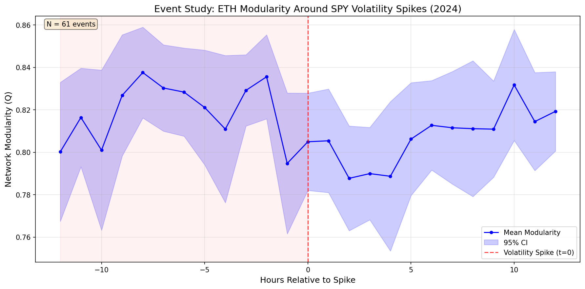
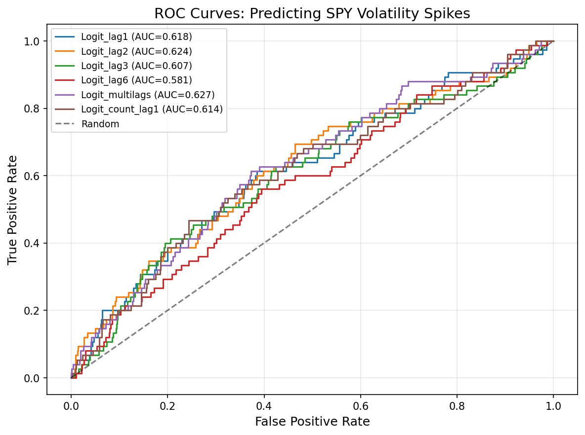

# Ethereum Network Modularity and Equity Volatility

An exploratory research pipeline relating Ethereum transaction-network structure to unusually large SPY returns. The project builds hourly graphs, measures community structure with Louvain modularity, aligns those metrics with equity observations, and runs event studies and regressions.

Original project context: NYU Tandon Financial Engineering capstone research.

## Work completed

- BigQuery transaction extraction and hourly weighted, undirected graph construction.
- Value-weighted and transaction-count-weighted modularity, node counts, and density.
- Rolling SPY return thresholds and volatility-event labels.
- UTC panel alignment and lagged network controls.
- Event-window plots, logistic and linear probability models with HAC standard errors.
- Alternative thresholds, graph weights, sample periods, and time controls.

## Data

| Input | Source | Configured sample | Role |
| --- | --- | --- | --- |
| Ethereum transactions | Google BigQuery `bigquery-public-data.crypto_ethereum.transactions` | 2024; 2020-01-15 to 2020-04-30 case study | Hourly address graphs |
| SPY prices | Yahoo Finance via `yfinance` | 2024 hourly bars | Equity returns and spike labels |
| SPY COVID prices | Yahoo Finance daily fallback; optional historical hourly provider adapter | 2020 case study | Separate descriptive analysis |

Raw transactions, assembled panels, and numerical regression tables are not tracked in this repository. Existing figures are retained. Historical intraday availability must be checked when reproducing the configured period; current providers may not supply the full requested history. BigQuery extraction can incur provider charges.

## Method

For each hour, transaction pairs form an undirected graph weighted by ETH value or transaction count. The configured minimum transfer is 0.001 ETH. Louvain modularity measures the graph's community structure.

The main spike label compares absolute SPY log returns with a rolling 95th percentile over up to 210 trading bars, with a minimum of 60 observations. The current rolling threshold includes the current observation. The 2024 regression uses lagged modularity, lagged log node count, and lagged density, with HAC standard errors. Lags in the merged panel advance through Ethereum calendar-hour rows. See [method and interpretation notes](docs/METHOD.md).

## Recorded findings and their scope

The original project reports a decrease in modularity around volatility events, opposite to the proposed increase. Recorded summary values include 61 events, a lag-one modularity coefficient of −2.02 (p=0.048), and AUC=0.618. The archived ROC figure also displays the 0.618 lag-one AUC.

**The current regression evaluates AUC on the same observations used to fit the model.** It is an in-sample fit statistic, not an out-of-sample early-warning score. Numerical tables and source inputs are absent, so the other reported summaries require reproducing the original run for independent verification. The association does not establish liquidation, contagion, or another causal mechanism.




## Getting started

Use Python 3.10+ and run from the repository root:

```bash
git clone https://github.com/lz3256/eth-modularity-volatility.git
cd eth-modularity-volatility
python3 -m venv .venv
source .venv/bin/activate
python -m pip install -r requirements.txt
python run_pipeline.py --help
```

Configure your own Google Cloud project in `config.py` and authenticate through the provider's normal workflow. Review the extraction SQL and requested date coverage before running data-download steps. Credentials are not included.

The runner supports individual stages and resuming from a stage:

```bash
# Requires prepared input files from preceding stages:
python run_pipeline.py --only 6 7 8
python run_pipeline.py --from 3
```

## Repository map

| Path | Purpose |
| --- | --- |
| `config.py` | Periods, thresholds, graph and regression parameters |
| `src/fetch_eth_data.py`, `src/fetch_spy_data.py` | Provider adapters |
| `src/build_networks.py`, `src/utils.py` | Graphs and network statistics |
| `src/compute_spikes.py`, `src/merge_dataset.py` | Labels and aligned panel |
| `src/event_study.py`, `src/regression.py`, `src/robustness.py` | Analysis and figures |
| `output/figures/` | Existing recorded visual outputs |
| `docs/METHOD.md` | Interpretation, reproducibility gaps, and next experiments |

## Next research steps

Use an explicit chronological holdout with train-only choices, retain numerical tables and data fingerprints, distinguish calendar-hour and trading-hour lags, and evaluate incremental performance against simple equity-only baselines. Keep the COVID daily fallback separate from hourly evidence.

## Credits and references

Project repository maintained by [@lz3256](https://github.com/lz3256). Documentation was reviewed and expanded with OpenAI Codex by inspecting source and recorded figures. Source data are attributed to Google BigQuery's Ethereum dataset and Yahoo Finance; dependencies retain their respective licenses.

Community detection follows Blondel et al., *Fast unfolding of communities in large networks* (2008). Network modularity is a descriptive graph statistic; its application here is exploratory.

## License

This project is for academic research purposes. MIT License.
